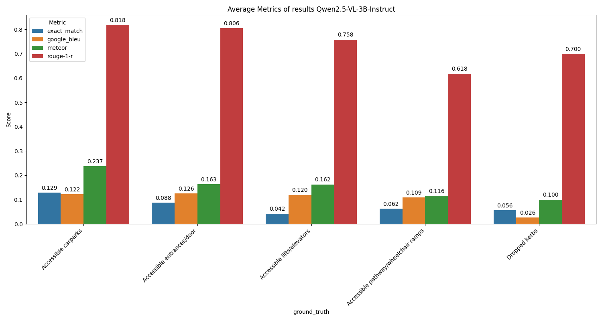
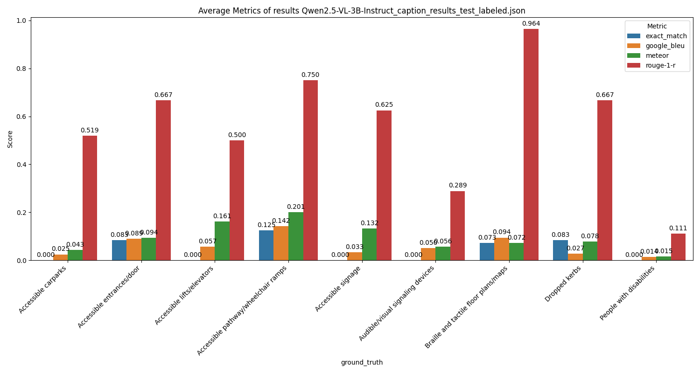

# Caption & Detection Experiment

## Motivation

A fixed class detection is challenging for detecting facilities with diversity and complexity. In order to conduct successfull detections we may try to detect related objects of the facility. (e.g. Detect the handrail instead of ramp itself). 

This can be a trade-off between object detection and image classification. 

Models to be tested:

Caption models: 
- [x] [Qwen/Qwen2.5-VL-3B-Instruct](https://huggingface.co/Qwen/Qwen2.5-VL-3B-Instruct)
- [x] [Qwen/Qwen2.5-VL-7B-Instruct](https://huggingface.co/Qwen/Qwen2.5-VL-7B-Instruct)
- [ ] ~~[google/paligemma-3b-mix-448](https://huggingface.co/google/paligemma-3b-mix-448)~~
- [ ] ~~[google/paligemma2-3b-pt-448](https://huggingface.co/google/paligemma2-3b-pt-448)~~
- [x] [google/paligemma-3b-ft-cococap-448](https://huggingface.co/google/paligemma-3b-ft-cococap-448)
- [x] [google/paligemma-3b-ft-vqav2-448](https://huggingface.co/google/paligemma-3b-ft-vqav2-448)


Detection models: 
- [ ] [AILab-CVC/YOLO-World](https://github.com/AILab-CVC/YOLO-World) 
- [ ] [google/paligemma-3b-mix-448](https://huggingface.co/google/paligemma-3b-mix-448)
- [ ] [google/paligemma2-3b-pt-448](https://huggingface.co/google/paligemma2-3b-pt-448)

## Metrics

Capion:
- Rouge
- Google BLEU
- meteor
- Bert Score
- Exact Match (Also used for checking whether detected)

## Data Preprocessing
- Filter images with bounding box occupying less than `4%` of the area.

## Results

PROMPT setting:
```python
facilities='''
Accessible entrances/door
Accessible pathway/wheelchair ramps
Directional guide paths
Warning guide paths
Dropped kerbs
Accessible lifts/elevators
Accessible signage
Braille and tactile floor plans/maps
Accessible carparks
Audible/visual signaling devices
People with disabilities
'''

PROMPT_CAPTION_TEMPLATE=f'''
Inside this image there exists facilities designed for the disabilities. Now please search over the image and LIST each of the facilities you find within 6 words. Seperate each of the description with comma. 

Possible facilities are:

{facilities}

What related facilities do you find in the image?
'''
```
Output example:
```json
"9": {
        "ground_truth": [
            "Accessible entrances/door"
        ],
        "prediction": [
            "Accessible pathway/wheelchair ramps",
            "Directional guide paths",
            "Warning guide paths",
            "Dropped kerbs",
            "Audible/visual signaling devices"
        ],
}

```


### SVI2 labels:
Filter settings:
    - Bounding boxes covers at least $4\%$ of area. (Which leaves 186 images with labels)
    
- `Qwen2.5-VL-3B-Instruct` 


### test_labeled:
Filter settings:
    - Bounding boxes covers at least $1\%$ of area. (Which leaves 22 images with labels)
- `Qwen2.5-VL-3B-Instruct` 


